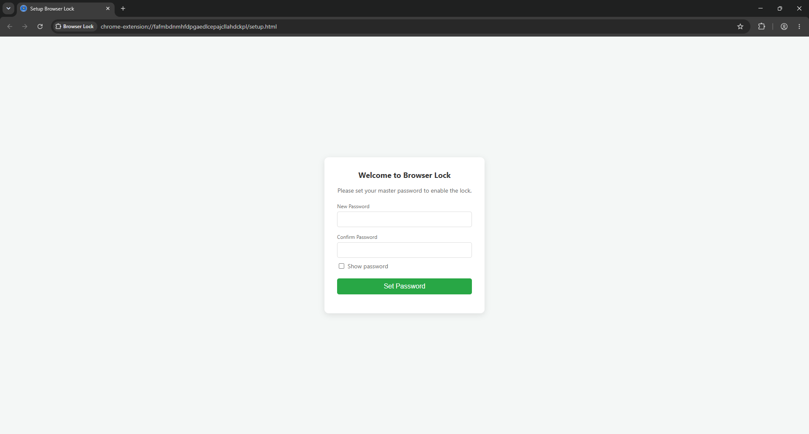

# Browser Lock - Chrome Extension

Browser Lock adalah ekstensi Google Chrome (Manifest V3) yang dirancang untuk mengunci browser Anda dengan password setiap kali pertama kali dibuka (*startup*). Ekstensi ini sangat berguna untuk menjaga privasi aktivitas *browsing* Anda dari akses yang tidak sah.

## ✨ Fitur Utama

- **Penguncian Startup Otomatis**: Menampilkan lapisan layar (overlay) yang meminta password setiap kali Google Chrome dibuka atau tab baru dibuat.
- **Auto-Open URLs**: Setelah browser berhasil dibuka (*unlocked*), ekstensi akan secara otomatis membuka daftar URL/website yang sudah Anda atur sebelumnya ke dalam tab-tab baru.
- **Tutup Tab Lain Otomatis**: Terdapat opsi (*toggle*) opsional untuk menutup semua tab yang sedang terbuka dan hanya menyisakan tab dari fitur *Auto-Open URLs* ketika browser berhasil dibuka.
- **Fokus Tab Otomatis**: Setelah tab *Auto-Open URLs* terbuka, ekstensi akan secara otomatis memfokuskan layar ke tab terakhir yang baru dibuat.
- **Mencegah Tab Baru Saat Terkunci**: Saat *lock screen* sedang aktif, ekstensi akan secara otomatis memblokir/menutup tab baru yang tidak sengaja atau sengaja dibuat dan memfokuskan kembali ke halaman layar kunci.
- **Anti-Inspect & Anti-Bypass**: Secara otomatis memblokir fungsi Klik Kanan (Context Menu) dan semua tombol *shortcut* Developer Tools (seperti F12, Ctrl+Shift+I, Ctrl+U) saat layar terkunci, sehingga layar kunci tidak bisa diretas menggunakan *Inspect Element*.
- **Pengaturan Modern**: Fitur ganti password, kelola daftar *Auto-Open URLs*, beserta opsi tambahannya yang dapat diakses melalui *Popup* UI yang elegan di *toolbar*.

## 📸 Tangkapan Layar (Screenshots)

### 1. Setup Awal (Membuat Password)

### 2. Layar Kunci (Browser Locked)

### 3. Pengaturan (Options Popup)

---

## ⚠️ Kelemahan Keamanan (Vulnerability)

Meskipun ekstensi ini dilengkapi dengan pengaman *Anti-Inspect*, ekstensi ini **masih memiliki satu celah kelemahan** yang berasal dari limitasi keamanan bawaan Google Chrome itu sendiri.

Layar kunci ini **bisa ditembus (*di-bypass*)** jika pengguna menekan klik kanan pada ikon ekstensi (atau melalui menu ekstensi Chrome) dan memilih opsi **"Remove from Chrome"**.

Sistem Chrome tidak mengizinkan ekstensi mana pun untuk memblokir, menyembunyikan, atau menonaktifkan opsi *Remove from Chrome* ini. Begitu ekstensi dihapus secara paksa dari luar, perlindungan password akan otomatis lenyap dan browser bisa diakses secara bebas.

### 💡 Solusi untuk Penggunaan Skala Besar
Jika Anda ingin menerapkan ekstensi ini secara absolut (tanpa bisa dihapus oleh pengguna) untuk keperluan Lab Komputer Sekolah, Warnet, atau Perusahaan, Anda harus menggunakan **Chrome Enterprise Policy (Group Policy)** di Windows atau Mac. 

Dengan mengonfigurasi ekstensi ini ke dalam daftar **Force-Installed**, opsi "Remove from Chrome" akan dikunci secara permanen oleh sistem operasi, dan pengguna biasa sama sekali tidak akan bisa menghapus ekstensi ini!
